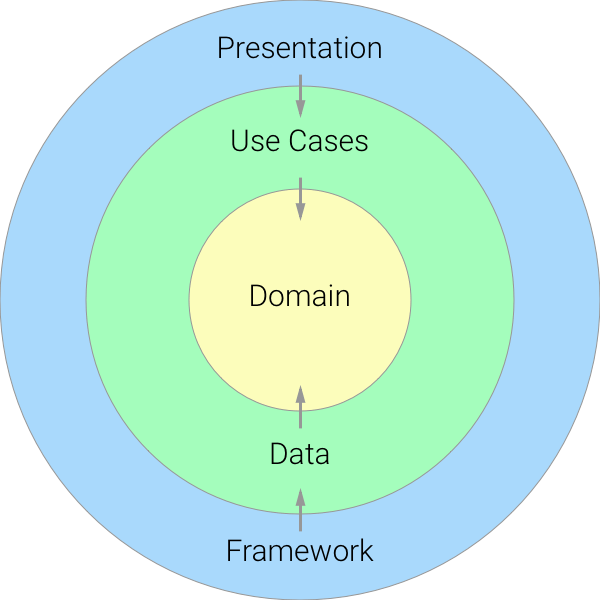
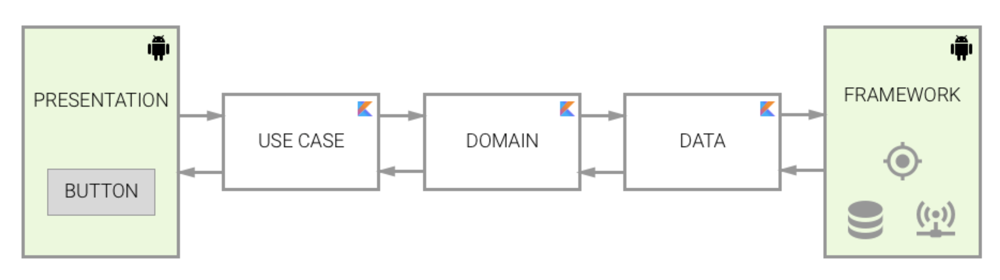

# README #

### Requerimientos técnicos para construir el proyecto ###

La aplicación se construyó y compiló usando las siguientes versiones:

* Android Studio 4.2
* Versión del Gradle 7.0.4
* Versión de Kotlin 1.4.31
* SDK mínimo: 23
* SDK de compilación: 31
* JDK 11

### Descripción de la responsabilidad de cada capa ###

El proyecto se basa en Clean Architecture usando el patrón de presentación MVVM, y se trabajó con las siguientes capas:

* **Presentation (app):** En esta capa se integra todo lo que tiene que ver con la interfaz de usuario (Activities/Fragments) y el framework de android, sus respectivos view models y el detalle de implementación de capas mas internas.
* **Use Cases:** Se identifican las acciones más relevantes que el usuario puede ejecutar en el uso de la app y se migran en esta capa, ejemplo (Consultar las películas de la base de datos local). También contiene los respectivos unit test del módulo.
* **Domain:** Se agregan las entidades con las que se trabaja el modelo de negocio de la app.
* **Data:** En esta capa se hace uso del patrón repository y se establecen las distintas fuentes de datos a utilizar a partir de abstracciones.

### Comunicación entre capas ###

La capa de presentación utiliza la capa de casos de uso, que a su vez va a utilizar el dominio para acceder a la capa de datos que es donde encontraremos los repositories de acceso a datos que hayamos definido, en este punto la comunicación se da através de abstracciones o interfaces las cuales se implementan en una capa superior llamada framework la cual tendrá acceso a los datos solicitados, esta comunicación mediante abstracciones es lo que en SOLID conocemos como inversión de dependencias. Luego, los datos obtenidos van de vuelta por la estructura de capas hasta llegar a la capa de presentación, que actualiza la interfaz de usuario.
